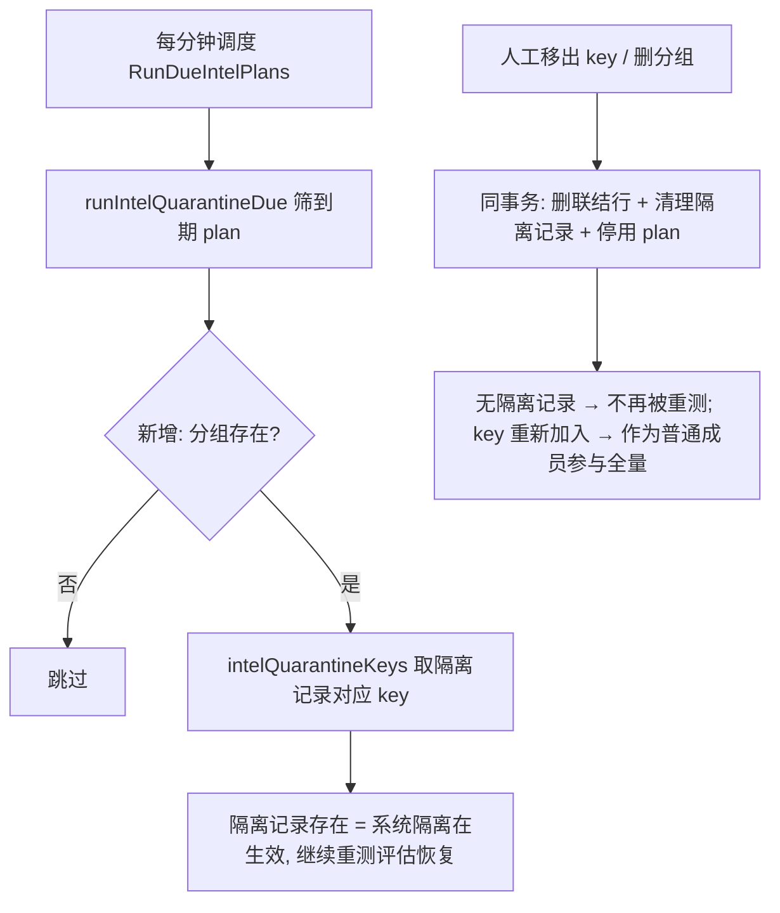

# 需求摘要

修复测智（intelligence testing）功能的缺陷：人工把 key 移出分组（分组仍存在）后，测智任务仍在持续测试该 key（真实调用上游 API）。

## 问题现象与根因（已核实）

- 分组 A 下有 key 甲、乙，设有测智任务；人工把甲移出分组后，测智仍测试甲。
- 根因：测智"隔离重测"链路**只按 `intel_quarantine_states`（隔离记录）取 key**（`intelQuarantineKeys`，intel_quarantine.go:54-78），完全不看分组成员关系。系统自动隔离时会移出分组并留下永久隔离记录（指数退避 60s→30min）；此后人工移除 key（`replaceRouteGroupKeys` / `BatchRouteGroupKeys` / `SetKeyRouteGroups`，routegroup.go）只删联结行、不清理隔离记录，于是重测永不停止。
- **关键设计约束（实施中已验证）**：隔离中的 key 本来就被系统移出了分组，重测必须继续（现有测试 `TestIntelQuarantineSchedulerRunsDueOnly` 验证此行为）。因此**读侧不能加"必须是分组成员"校验**，否则隔离重测设计被破坏。

## 修复方案（写侧维护不变量为主，读侧分组存在性防御为辅）

### A. 写侧清理 —— 主修复（backend/internal/ops/routegroup.go）

人工管理成员的所有路径，在与联结行删除**同一事务**内同步清理隔离记录：

- `replaceRouteGroupKeys`（405-410）：计算被移出的 key（旧成员 − 新成员），删除这些 key 在该分组所有测智 plan 下的 `intel_quarantine_states`
- `BatchRouteGroupKeys`（486-514）：对 remove 批次中的 key 同上
- `SetKeyRouteGroups`（521-565）：key 被移出的分组，删除该 key 在这些分组 plan 下的隔离记录
- `DeleteRouteGroup`（349-384）：事务内删除该分组全部隔离记录 + 自动停用（enabled=false）引用该分组的 `intel_test_plans`（保留记录可查）

清理 SQL 形如：`DELETE FROM intel_quarantine_states WHERE platform_key_id IN (?) AND plan_id IN (SELECT id FROM intel_test_plans WHERE route_group_id = ?)`

不变量：`intel_quarantine_states` 存在记录 ⟺ 系统隔离在生效。人工移除后记录即被清理，读侧无需（也不能）校验成员关系。

### B. 读侧防御 —— 仅分组存在性（backend/internal/ops/intel_quarantine.go，部分已实施）

- `runIntelQuarantineDue`（271-286）：已加 `JOIN route_groups` 校验分组存在（针对分组被删场景的兜底）
- `intelQuarantineKeys`：加分组存在性检查（分组被删则返回空），**不加成员校验**
- 抽取 `intelPlanGroupExists` 辅助函数供 `RunIntelPlan` / `RunIntelQuarantine` 复用：分组不存在时拒绝发起运行（返回新错误 `ErrIntelGroupMissing`），handler 映射为友好提示

### C. 恢复防护（intel_quarantine.go）

- `restoreIntelKey`（247-267）：增加分组存在性检查（对齐 `RestoreIntelPlanQuarantined` 299-302 行的既有实现），分组不存在时不回插 `route_group_keys` 联结行

### D. 存量数据清理（迁移）

- 删除指向不存在分组的 `intel_quarantine_states` 与孤儿 `route_group_keys` 联结行
- 引用不存在分组的 enabled `intel_test_plans` 置为停用

### E. 回归测试（backend/internal/ops）

1. 人工把隔离中的 key 移出分组（replaceRouteGroupKeys / SetKeyRouteGroups）→ 隔离记录被清理，`RunDueIntelPlans` 不再测试该 key
2. 人工移出后重新加入分组 → 作为普通成员参与全量测试，无隔离记录残留
3. 删除分组 → plan 被停用、隔离记录被清理，不再有任何调度
4. 分组不存在时 `restoreIntelKey` 不回插联结行
5. 现有 `TestIntelQuarantineSchedulerRunsDueOnly`（系统隔离 key 不在分组也重测）必须继续通过

## 架构设计

## 行为语义（修复后）

- 系统隔离（正确率过低自动移出）：继续按退避重测，连对 2 次自动恢复回分组 —— 保持现状
- 人工移出：立即清理隔离记录，不再重测、不会被自动"恢复"回分组
- 人工删除分组：引用它的测智任务自动停用，全部隔离记录清理
- 人工移出后又重新加入：作为普通成员参与全量测试（干净状态）