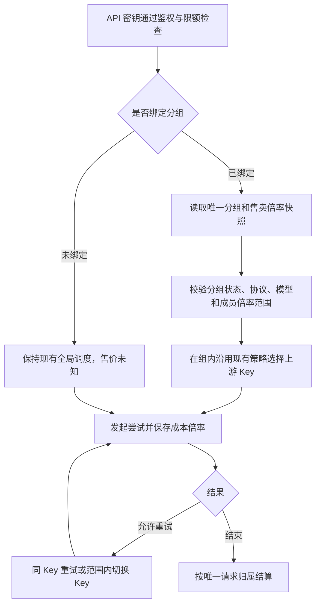
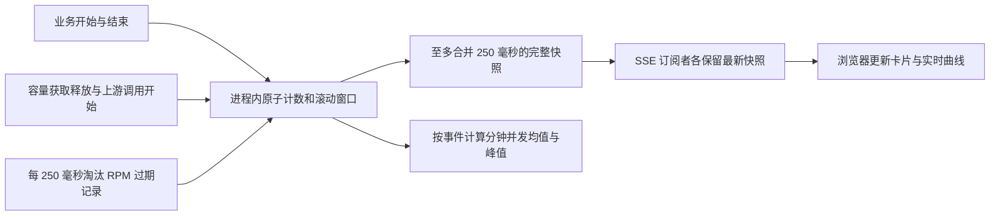
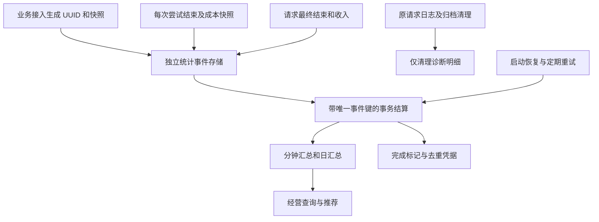

# 实时仪表盘设计方案

状态：待实施。日期：2026-09-16。本文定义目标行为，描述为“新增”的能力尚未实现。

配套文档：[实施计划](dashboard-implementation-plan.md)。本文是业务口径和接口行为的依据；任务进度在实施计划中维护。

## 1. 目标与已确认边界

仪表盘回答三个问题：现在跑得怎样、经营收益怎样、接下来应给谁充值。

- 展示实时运行、经营统计、近 30 天趋势、长期累计及充值建议。
- 业务并发、业务 RPM、上游尝试并发和 RPM 实时推送；正常连接下，服务端变化到浏览器展示的延迟目标不超过 1 秒。
- API 密钥最多绑定一个分组；一个分组可绑定多把 API 密钥。未绑定密钥保持现有全局调度行为，不要求整理旧数据。
- 绑定分组的请求只在组内调度。上游 Key 可属于多个分组，请求归属由调用方 API 密钥确定。
- 上游 Key 新增独立“允许探测”开关，允许 `status=enabled` 且 `probe_enabled=false`：继续承接正常业务，但跳过诊断探测。该开关作用于提供商的上游 Key，不是调用方 API 密钥。
- 分组售卖倍率仅用于预估收入和毛利，不修改现有额度扣减、限流或 `/v1/usage` 行为。
- 成本直接使用上游 Key 现有倍率，不增加充值折扣、汇率、实际收款账本或自动充值。
- 使用当前单实例部署；不扩展分布式实时计数。金额统一为 USD，日历时区固定为 `Asia/Shanghai`，数据库时间存 UTC。
- 当前没有绑定多个分组的密钥，不开发迁移向导。新写入必须校验最多一个分组。

## 2. 代码现状与实现入口

以下为编写文档时已核对的代码事实；符号名用于后续定位，行号随开发变化。

| 模块 | 当前行为 | 本次新增 |
| --- | --- | --- |
| [分组解析](../backend/internal/ops/routegroup.go)，`ResolveAllowKeys` | 合并调用方绑定的匹配分组成员，返回允许 Key 集合 | 单分组归属及价格快照；未绑定保持允许全部 |
| [领域模型](../backend/internal/domain/models.go)，`RouteGroup`、`ConsumerRouteGroup` | 分组没有售价，绑定为多对多关联表 | 可空售价、绑定唯一约束、请求归属快照 |
| [网关](../backend/internal/handler/gateway.go)，`proxy`、`forwardOnce` | 业务请求、同 Key 重试、故障转移；请求结束时保存费用 | 生命周期计数、来源标记、逐尝试费用和最终结算 |
| [调度运行态](../backend/internal/picker/band.go)，`TryAcquire`、`Release` | 进程内 Key/提供商并发、获取配额次数窗口 | 独立的业务指标和实际发起尝试指标，不直接把限流计数当业务 RPM |
| [尝试记录](../backend/internal/handler/attempt.go)，`completeAttempt` | 已区分成功、上游失败、取消、容量拒绝等，无费用字段 | 费用与状态快照，支持供应商质量分析 |
| [费用估算](../backend/internal/handler/cost.go)、[Token 计价](../backend/internal/upstream/cost.go) | 优先上游报告费用，缺失时估算；旧日志可用当前价临时补算 | 独立测算金额、固定历史计价依据，不复用旧日志临时补算做账 |
| [日志清理](../backend/internal/ops/logs.go)，`PurgeRequestLogs` | 请求和尝试默认保留 24 小时 | 独立统计存储及清理保护 |
| [提供商页面](../frontend/src/views/UpstreamsView.vue)，`renderBalance` | 余额属于提供商；每个 Key DTO 也附带同一余额 | 按提供商去重汇总；保留未知、不限额语义 |
| [探测服务](../backend/internal/ops/ops.go)，`ProbeKey`、`probeFilteredAt` | 仅有启用状态、探测间隔和近期请求跳过规则；没有独立探测开关 | Key 级允许探测开关，定时、批量及单 Key 入口统一校验 |
| [API 密钥页面](../frontend/src/views/ApiKeysView.vue) | 分组选择器支持多选 | 可留空单选、分组售价输入 |
| [路由](../frontend/src/router/index.ts)、[HTTP 客户端](../frontend/src/api/http.ts) | 默认首页为提供商，使用 Bearer 请求头 | 仪表盘首页、带认证的流式订阅 |

其他依据：[现有路由与会话行为](stable-latency-rollout.md)、[日志归档及部署约束](request-log-archives.md)。前端沿用 Vue、Naive UI，新增 ECharts 图表依赖。

## 3. 分组归属与售卖倍率

### 3.1 绑定和路由



- 请求通过鉴权和限额检查后、开始读取正文前，固定绑定、分组售价及不可变计价目录版本。本次请求中不因管理员改价、改绑定而变更归属；正文解析得到模型后，从该版本补齐模型价格。解析失败保留空模型并正常结束统计。每次选择上游时捕获该 Key 当时的成本倍率。
- 绑定但停用、不匹配或没有可用成员，沿用现有无可用上游错误语义，不退到全局调度；未绑定仍可正常使用全局调度。
- 保留原有失败分类、重试预算、会话粘滞和“响应已输出后不重放”的行为；改绑定后会话继续受新允许 Key 集合约束。
- 删除仍有 API 密钥绑定的分组返回冲突，先显式解绑或改绑，避免删除分组让调用范围意外扩大。已删除对象的历史统计保留 ID、名称快照。

### 3.2 配置接口

- 分组新增 `sale_multiplier: number | null`，单位是基准价倍数。初始为 `null`，表示未配置；允许零表示赠送，拒绝负数、非有限数和超出 `decimal(12,6)` 精度范围的输入。
- 更新时字段省略表示不修改，显式 `null` 清空。新字段不影响已有参考倍率区间 `rate_min/rate_max`。
- API 密钥新增 `route_group_id: number | null`，创建默认未绑定；更新省略不修改，`null` 解绑。旧 `route_group_ids` 接受空数组或单元素；多个元素、两个字段表达不同绑定时返回 400。
- 响应提供新单值字段，兼容返回零个或一个元素的 `route_groups`。保存关联使用事务，并在 `consumer_route_groups.consumer_key_id` 增加唯一索引，防止并发写入多组。
- 若实际部署数据意外出现多组，迁移报明冲突 ID 并停止变更，不自行挑选或删除绑定；这属于异常处理，不增加迁移向导。

### 3.3 上游 Key 可启用但关闭探测

**字段与兼容**：`PlatformKey` 新增 `probe_enabled: boolean`，非空、默认 `true`。已有 Key 迁移为 `true`，保持原行为；创建省略使用 `true`，更新省略不修改，显式 `false` 必须正确保存，`null` 返回 400。通过现有 `POST /upstreams/:id/keys`、`PUT /keys/:id` 读写，在 Key 列表/详情 DTO 返回；这些路径均带管理 API 前缀。迁移重复运行不得把已保存的 `false` 重置为 `true`。

`probe_interval_sec` 继续只表达频率：0 跟随全局间隔，正数为自定义间隔，不使用负数或 0 表达停探。关闭时保留原间隔，重新打开后恢复原窗口、去重和近期请求抑制规则，不补跑关闭期间的任务。

| 场景 | `probe_enabled=false` 的行为 |
| --- | --- |
| 定时轻量/深度探测 | 跳过，不访问上游 |
| 手动探测全部、探测某提供商 | 跳过该 Key，计入 `skipped`，不计成功或失败 |
| 单 Key 轻量/深度探测，包括 `/probes/run` 的 `key_id` 入口 | 返回成功响应中的结构化跳过结果，不访问上游；没有强制绕过参数 |
| 管理员“测试 API 密钥” | 作为诊断流量，仅在原允许范围内选择允许探测的上游 Key；全被关闭时返回明确的诊断跳过原因，不扩大分组范围 |
| 正常外部调用、业务重试及真实请求驱动的熔断恢复验证 | 正常参与，仍遵守现有状态、容量、余额、熔断等条件；不因停探额外排除 Key |
| 余额刷新、倍率同步、显式获取模型 | 保持原行为，这些管理操作不属于本开关控制的健康诊断探测 |

**执行与结果**：批量任务在排队前筛选，统一 `ProbeKey` 入口及测试调用选定 Key 后、发起上游前再次检查，覆盖排队期间配置变化。检查读库失败按错误终止诊断，不视为允许探测；关闭前已获准执行的在途探测允许自然完成，保存设置不取消真实业务请求。重新启用 Key 或提供商不自动打开探测开关。

单 Key 跳过采用 `{ok:true,data:{skipped:true,reason:"probe_disabled",message:"该 Key 已关闭探测"}}`，不写入伪造的 `success`。批量保留 `ok/failed/skipped` 计数，并新增 `skipped_reasons.probe_disabled` 数量；如果出队后发现关闭，也计跳过。前端单独显示跳过提示。管理员测试无可用诊断候选时，在已有测试结果中返回 `skipped:true` 及相同原因，不记为上游失败。

**健康与统计**：跳过不新增 `ProbeLog`、不推进 `last_probe_at`，不写探测失败、不消耗探测节流名额、不重置健康状态、评分或业务熔断。关闭前历史样本按既有窗口自然过期；关闭后仍收集真实业务样本，用于路由、仪表盘和充值推荐。现有 [诊断与业务路由隔离](probe-routing-isolation.md)继续适用，`recovery_validation` 使用真实请求，不属于停探范围。

**界面**：提供商页 Key 新建/编辑表单增加“允许探测”开关，默认开启；关闭后探测间隔输入禁用但保留值，提示“关闭诊断探测，Key 仍参与正常请求调度”。Key 行显示“探测已关闭”，单 Key 探测按钮禁用并解释原因；批量操作展示跳过数量。健康脉冲保留历史和真实请求样本，没有新样本时展示无样本，不标成故障或伪造健康；余额、模型操作正常可用。

## 4. 指标字典

所有比率以 `[0,1]` 返回，界面格式化为百分比；无分母时返回 `null`，不显示为 0%。金额保留 8 位小数入账，使用十进制定点运算，中间计算不提前舍入。

“业务请求”指生成类网关端点中通过鉴权、额度和调用方限流检查的外部请求，从开始读取请求体计入；包括之后解析、路由或上游失败。`/v1/models`、`/v1/usage`、鉴权前拒绝及管理员测试不计入。

| 指标 | 定义及边界 |
| --- | --- |
| 业务并发 | 已进入上述生命周期且网关处理尚未结束的请求数；包含读取、重试等待及输出响应过程；每个请求仅加减一次 |
| 业务 RPM | 最近 `(now-60s, now]` 开始的业务请求数，不是某固定分钟平均值；重试不增加此数 |
| 上游尝试并发 | 业务流量已获得上游容量且尚未释放的尝试数；从获取资源成功到释放，包含本地请求准备阶段 |
| 上游尝试 RPM | 最近 60 秒实际调用上游 HTTP 客户端的次数；同 Key 重试及换 Key 都增加；容量拒绝、本地构建失败不增加 |
| 请求量 | 区间内开始的业务请求数；完成数单列，跨区间请求不要求开始数等于完成数 |
| 业务成功率 | 区间内有效成功完成数 / 已结束业务请求数；进行中不入分母，失败包含客户端取消等最终非成功结果 |
| 供应商成功率 | 有效成功尝试 /（有效成功尝试 + 上游责任失败尝试）；排除本地错误、请求参数拒绝、客户端取消和本地容量拒绝；上游限流计为失败 |
| 首字延迟 P50/P95 | 成功且 `ttft_status=measured` 的样本；业务图表为请求累计等待，推荐榜为单次上游尝试等待；非流式或无实测样本单列，不填零 |
| 重试率 | 已结束且实际发起至少两次上游调用的业务请求 / 已结束业务请求；同 Key 重试和故障转移均算 |
| 总余额 | 每个提供商的有限已知余额求和，包括停用提供商；另列启用提供商余额。`null` 且有更新时间沿用“不限额”，无更新时间为“未知” |
| 预估收入 | 成功请求基准费用 × 请求开始时的分组售卖倍率；已知失败收入为零；未绑定或未配置售价时不进入利润统计 |
| 预估成本 | 每次上游尝试基准费用 × 该尝试成本倍率，包含失败尝试的已知用量成本 |
| 消耗 | 用于观察上游余额消耗；每次尝试优先报告费用，缺失时用预估成本。响应同时给出报告、估算和未知数量 |
| 预估毛利 | 可完整测算请求的预估收入 − 全部尝试预估成本，不扣其他运营费用 |
| 毛利率 | 完整测算集合的总毛利 / 总收入；收入为零时为 `null`；负毛利原样显示 |
| 利润覆盖率 | 完整测算的已结束业务请求数 / 全部已结束业务请求数；同时给出未绑定、缺售价、缺价格、缺用量等原因计数 |

时间归属：请求开始计数用开始时间；成功率、重试率和请求级财务汇总用请求完成时间；供应商质量和消耗用尝试完成时间。页面注明这两类统计口径，跨日时不强行对齐。实时指标不受历史日期筛选影响。

来源由服务器上下文标记为 `business`、`admin_test` 或 `probe`，外部请求头不决定来源。测试和探测排除出业务四项实时指标、收入和推荐质量；已知测试消耗独立展示。

## 5. 实时计数与推送



### 5.1 服务端

- 四项运行指标独立于日志写入，使用生命周期令牌保证结束幂等；成功、错误、取消、panic 清理都经过释放路径，不使用数据库 `in_flight` 数量充当当前并发。
- 复用获取资源成功及释放的时机，但不修改调度器限流口径。RPM 的“实际发送”发生在 HTTP 客户端调用前，区别于 `TryAcquire` 的限流窗口。
- 新 SSE 连接立即发送完整 `snapshot`；指标变化最多合并 250ms；250ms 检查过期窗口，零新流量时 RPM 仍下降至零。订阅者数量不改变业务计数。
- 每个订阅者仅缓存一份最新快照，覆盖旧快照；慢客户端不阻塞网关。流式写入设置 5 秒写超时并清理失效连接。
- 每 15 秒发送 `heartbeat`；头部使用 `text/event-stream`、`Cache-Control: no-cache, no-transform`、`X-Accel-Buffering: no`，逐事件 flush，代理对该路径关闭缓存、压缩聚合及缓冲，空闲超时至少 60 秒。
- 实时状态内存存储。进程重启生成新 `instance_id`，并发归零，RPM 窗口重新积累，前 60 秒 `window_complete=false`；持久经营数据继续使用原统计起点。

### 5.2 事件与客户端

`GET /api/v1/admin/dashboard/live` 使用现有管理员 Bearer 鉴权。前端通过 `fetch` 和流读取器解析 SSE，处理跨数据块、多个事件和 UTF-8 边界，不把 Token 放进 URL。

```text
event: snapshot
data: {"schema_version":1,"instance_id":"INSTANCE","sequence":42,"server_time":"2026-09-16T08:00:00Z","started_at":"2026-09-16T07:00:00Z","window_seconds":60,"window_complete":true,"business_inflight":12,"business_rpm":180,"upstream_inflight":10,"upstream_rpm":194}

event: heartbeat
data: {"instance_id":"INSTANCE","server_time":"2026-09-16T08:00:15Z"}
```

- `sequence` 在实例内单调递增。重连直接收到最新快照，不重放全部历史事件；实时曲线空档标记为缺测，不插值制造连续流量。
- 页面正常前台、链路健康时，事件发生到 DOM 展示延迟 ≤1 秒；浏览器后台节流、休眠和断网显示恢复状态，不承诺这段时间的展示延迟。
- 断线立即显示“重连中”和最后有效更新时间，旧数值标记过期。未收到任意事件超过 35 秒主动断开重连；退避为 1、2、4、8、15 秒，后续保持 15 秒。
- 401 触发现有登录失效流程且停止自动重连。离开页面调用 `AbortController` 关闭连接；暂停显示“已暂停”，恢复新建订阅并获取全量快照。
- 实时卡片和短时曲线使用 SSE；经营统计、历史趋势和榜单每 30 秒刷新，可手动刷新。余额 freshness 取上游实际刷新时间，推送不代表重新向上游查余额。

## 6. 价格快照、结算与持久统计

### 6.1 计价依据

- 请求开始保存内部 UUID（不使用客户端 `X-Request-Id` 做幂等键）、调用方 ID、分组 ID/名称、售卖倍率及计价目录/规则版本；模型和对应价格按第 3.1 节在正文解析后补齐，慢上传期间仍使用入口固定版本。目录同步发布新的不可变版本，旧版本引用保留到相关请求解析完成；已解析请求持久化所需实际价格，不依赖旧目录永久存在。每次尝试保存独立 UUID、提供商/Key ID、成本倍率。
- 将用量统一为非缓存输入、缓存读取、缓存写入和输出四类。OpenAI 的总输入先扣除其中缓存部分；Anthropic 已是非缓存输入，不再重复扣除。同时保存原始协议及用量存在标记，区分“明确为零”和“没有数据”。
- 沿用当前默认缓存系数：读取为输入单价的 0.1，写入为 1.25；与输入/输出单价一起保存快照。基准费用为四类 Token × 对应价格之和 / 1,000,000；价格缺失时不按零计。
- 模型目录当前没有充分价格信息的计费类型（如按张图片收费）保留未知；即使上游报告了费用，也不将其反推为基准收入。
- 对每次尝试独立保存 `estimated_cost_usd`、`reported_cost_usd`、`consumption_usd` 和费用来源。网关合成的估算值不得标记为上游报告值。
- 成功请求只计算一次销售收入；所有实际发起尝试的预估成本相加。明确未发出网络请求的本地失败成本为零；已发出的失败尝试若无费用证据，成本为未知。
- 请求组内切换提供商后，收入归属最终成功提供商；已知尝试成本归各自提供商。提供商利润榜只使用完整测算请求的收入和成本分摊，失败尝试成本可以形成负贡献；消耗榜仍包含全部已知消耗。
- `sale_multiplier=0` 合法，收入为零、毛利可为负。未绑定或售价未知不纳入利润；成功且 Token 明确全部为零可按零用量测算，未返回 usage 则标记未知。
- 页面总收入可展示所有已知收入，但毛利及毛利率必须限定完整测算集合，并附该集合收入与成本，避免用户用不同覆盖范围的卡片误相减。

### 6.2 数据流与一致性



建议新增专用 `dashboard` 服务模块；领域数据包括统计请求事实、尝试事实、聚合事件凭据、分钟汇总、日汇总、运行区间和设置。它们不依赖请求日志或归档的级联生命周期，不保存正文和密钥。

- 入站、尝试终结、请求终结使用不同事件键；存储事件、更新对应汇总及标记已处理在事务内完成，唯一键冲突视为已处理，不重复加总。请求结算在全部尝试终结后执行，避免漏算 defer 中保存的最后一次尝试。
- 请求入账和尝试消耗入账是不同指标族；同一成本可以分别用于业务请求利润及上游消耗分析，但一个汇总卡片只能查询对应指标族，避免双计。
- 数据库写入与计数推送分离。持久化失败记录结构化错误和缺口时段，保留有界重试队列；每秒重试，指数退避最多 30 秒。积压上限 10,000 个事件，溢出标记数据不完整，不阻塞代理响应；指标响应暴露 `data_quality`。
- 已持久化事件启动时重新扫描未处理项。进程硬退出前未持久化事件不假装恢复；运行区间记录用于显示潜在缺口。未完成请求超过现有 6 分钟失效阈值标记 interrupted，收入及未知尝试成本不伪造，保留已知尝试消耗。
- 分钟数据保留 30 天，日数据长期保留。细粒度事实保留 30 天且必须已聚合后才能清理；轻量幂等凭据保留 31 天，拒绝超过 30 天的事件重放，不因删除凭据而重复入账。
- 原诊断日志仍按现有 24 小时默认保留；不得删除待聚合统计事件。历史对象删除不级联删除聚合数据。
- 时间桶采用统一 UTC 时间戳，日桶按上海时区零点划分；查询区间为 `[from,to)`。分钟数据可合并为小时，长周期直接查日汇总，长期累计合并已完成日与当天增量，避免重复当天。
- 并发按事件积分计算时间加权均值和峰值；运行区间以外为缺测。延迟使用固定可合并直方图，不对各分钟 P95 再取平均；桶上界毫秒为 100、250、500、1000、2000、3000、5000、7500、10000、15000、20000、30000、60000、120000、300000、+Inf。分位数标为近似值并返回样本量，溢出显示大于最大有限桶。
- 新统计从启用时刻起积累，保存 `available_from`。不重算旧日志利润；不把启用前空白展示为零。

## 7. 充值推荐

### 7.1 急需充值

- 只对启用、有限已知余额的提供商排名；按最近完整 24 小时本网关消耗计算每小时平均速度，`预计小时数=max(余额,0)/平均每小时消耗`。
- 默认剩余不足 48 小时提醒，耗尽置顶，其余按预计时间升序。榜单展示余额时间、消耗覆盖率、24 小时消耗及推荐原因。
- 余额超过两倍配置的余额刷新周期视为过期；自动刷新周期为零时用两分钟作为过期阈值。余额过期、统计不足 24 小时、存在未知尝试消耗或统计缺口时只展示“预测依据不足”。
- 零消耗显示暂无消耗，不展示无限天；不限额不参加；停用提供商可在余额概览查看，不提示充值。
- 标注“仅按本网关流量估算”，不把其他渠道用量或充值变化当作已知。健康不佳但余额即将耗尽仍可提示风险，同时说明暂不建议继续投入。

### 7.2 值得投入

- 使用近 7 天业务尝试，在同一分组、模型、协议、端点、流式类型的需求单元内比较。排除测试，沿用第 4 节供应商质量口径。
- 默认有效质量样本 ≥100、成功率 ≥98%、实测成功首字样本 ≥100 且 P95 ≤10 秒进入推荐；缺少首字证据的需求列待观察。门槛通过仪表盘设置持久化。
- 在质量达标的共同需求内，按单位预估成本毛利（完整集合毛利 / 完整集合成本）降序。成本为零或财务覆盖率低于 90% 不输出确定排名；同分按样本量降序、提供商 ID 升序。
- 提供商在每个需求单元的财务覆盖率：其参与过的完整测算已结束请求数 / 其参与过的全部已结束业务请求数，按内部请求 UUID 去重；同一提供商的多次尝试不重复增加分母。该单元毛利按第 6.1 节收入和成本分摊规则计算。
- 综合榜使用共有需求近 7 天的基准费用占比作统一权重，各提供商使用同一组权重；不按每家自己的业务结构加权。需求权重只计成功且基准价格已知、已绑定分组的唯一业务请求的成功响应基准费用，按请求完成时间入窗；不累加失败尝试基准费用，也不因参与多个提供商重复统计。
- 共同需求集合取全部达标候选的交集。覆盖率分母是全部已绑定且基准价已知的成功业务请求基准费用，分子为其中落在共同需求的部分；覆盖至少 50% 才生成综合榜，否则仅展示需求分榜，不捏造全局名次。共同需求内权重为各需求基准费用 / 共同需求基准费用总和。
- 数值示例：一笔售价倍率 0.3 的请求，A 失败尝试基准费用 0.2、成本倍率 0.1，随后 B 成功响应基准费用 1、成本倍率 0.15。收入为 0.30，成本为 0.02+0.15=0.17，毛利为 0.13；提供商 A 毛利贡献 -0.02，B 为 0.15，合计仍为 0.13。A、B 的参与请求分母各加一；全局业务请求和需求权重只计一笔，权重基准费用为 1，不是 1.2。若 A 用量未知，则整笔请求不进入完整毛利集合，B 已知收入和已知费用仍可分别显示。
- 页面同时展示需求覆盖、样本、成功率、P95、成本倍率、毛利率、实际用量和余额；没有数据的提供商列为待观察，绝不按零错误或零成本排第一。
- 无实际收款与充值账本，标题使用“预估性价比”和“预估毛利”。推荐不自动改路由、不自动充值。

## 8. 接口与页面

### 8.1 管理接口

所有路径前缀 `/api/v1/admin`，除 SSE 外沿用 `{ok,data}` 响应。实现时前后端共用本文字段语义，不在浏览器下载全部日志聚合。

| 方法与路径 | 输入 | 输出要点 |
| --- | --- | --- |
| `GET /dashboard/live` | Bearer；无历史筛选 | 第 5 节 SSE 快照和心跳 |
| `GET /dashboard/overview` | `from,to` | 期间业务、财务、覆盖率；独立的当前余额分区 |
| `GET /dashboard/trends` | `from,to,granularity=minute/hour/day` | 时间桶、完整性、请求量、并发均值/峰值、质量及财务 |
| `GET /dashboard/rankings` | `from,to,dimension=group/provider,page,page_size` | 聚合排行；默认毛利降序，未纳入测算单列；每页默认 20、最大 100 |
| `GET /dashboard/recommendations` | 无日期参数 | 固定最近 24 小时/7 天的两个榜单及待观察项，不随页面历史范围改变 |
| `GET/PUT /dashboard/settings` | PUT 设置字段 | 推荐阈值；默认值见第 7 节，更新校验范围并持久化 |

聚合响应公共元数据：`generated_at`、`available_from`、`timezone`、`range`、`data_quality`。质量信息包含 `complete`、缺口时段及未测算原因计数；余额单独包含实际刷新时间。时间参数用 RFC3339；`to` 必须大于 `from`。分钟/小时仅查询近 30 天，更早只支持上海自然日边界的日查询；非法范围返回 400，不静默裁剪。

设置字段默认：`renewal_horizon_hours=48`、`min_quality_samples=100`、`min_success_rate=0.98`、`min_ttft_samples=100`、`max_ttft_p95_ms=10000`、`min_finance_coverage=0.90`、`min_common_demand_coverage=0.50`。计数及时间为正数，比率在 `(0,1]`。

财务对象包含 `known_revenue_usd`、`known_estimated_cost_usd`、`consumption_usd`，以及完整测算集合的 `covered_revenue_usd`、`covered_cost_usd`、`estimated_profit_usd`、`margin`、`coverage`；金额未知返回 `null`，有部分已知时明确标注“已知部分”。

### 8.2 页面布局

1. 顶部为四张实时卡片、连接状态、更新时间及暂停开关，下方为实时短时曲线。
2. 经营区域提供今日、7 天、30 天、自定义和累计切换，默认今日。当前余额与期间金额分区，避免混淆。
3. 中部展示流量/失败率趋势、消耗/毛利趋势及成功率、P50/P95、重试率；异常和数据不足有明确空状态。
4. 底部展示分组与提供商排行、急需充值、值得投入及待观察；附计算口径和推荐原因。
5. 点击提供商进入对应提供商，分组进入 API 密钥页对应分组，点击请求统计进入带相应过滤条件的日志页；需要补分组日志过滤，旧无分组快照日志不猜测归属。超过日志保留期限提示明细已清理，汇总仍可查。
6. 默认路由改为 `/dashboard`，菜单加入仪表盘；移动端卡片折行，图表自适应，表格支持横向滚动，连接异常不清空已有历史数据。

## 9. 兼容、交付与验收

- 数据库仅新增相关字段、表和约束；已有分组售价为空，不修改既有 `cost_usd` 与 `quota_used` 的语义。普通回滚只恢复旧应用，保留新增表与绑定唯一索引：已有单组和未绑定调用继续工作，旧版界面虽支持多选，提交多组会被数据库约束拒绝。回滚不自动恢复多组能力，也不自动删除索引；重新升级仍检查绑定唯一性。
- `probe_enabled` 对旧版应用不可见，回滚旧版后诊断任务可能恢复探测已关闭的 Key；上线/回滚说明必须提示这一兼容边界，重新升级后继续尊重数据库中保存的开关值。
- 单实例范围的实时指标、重启后 RPM 暖机、后台浏览器节流及统计写入失败需要在 UI 如实呈现。
- 经营数据和实时状态独立故障隔离；数据库失败不阻塞计数推送，实时断线不使已存财务汇总失效。
- 完整测试与部署检查见[实施计划 T07、T08](dashboard-implementation-plan.md#t07-集成验证与修复)。上线验证统计从新请求开始，确认未配置售价提示、覆盖率、日志清理后留存以及四项实时指标的延迟。
- 本次文档交付不包含业务实现、依赖安装、数据迁移或服务部署。
